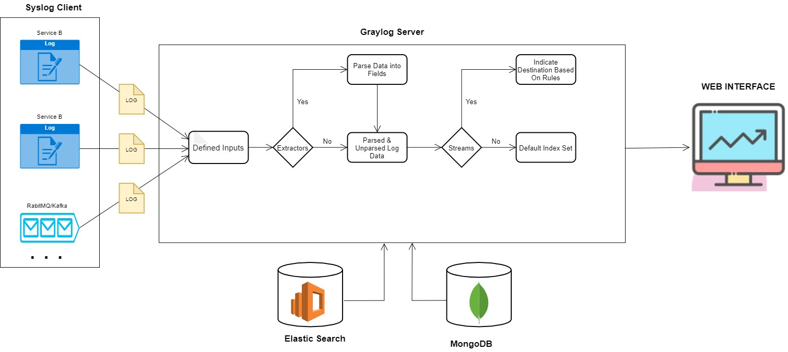
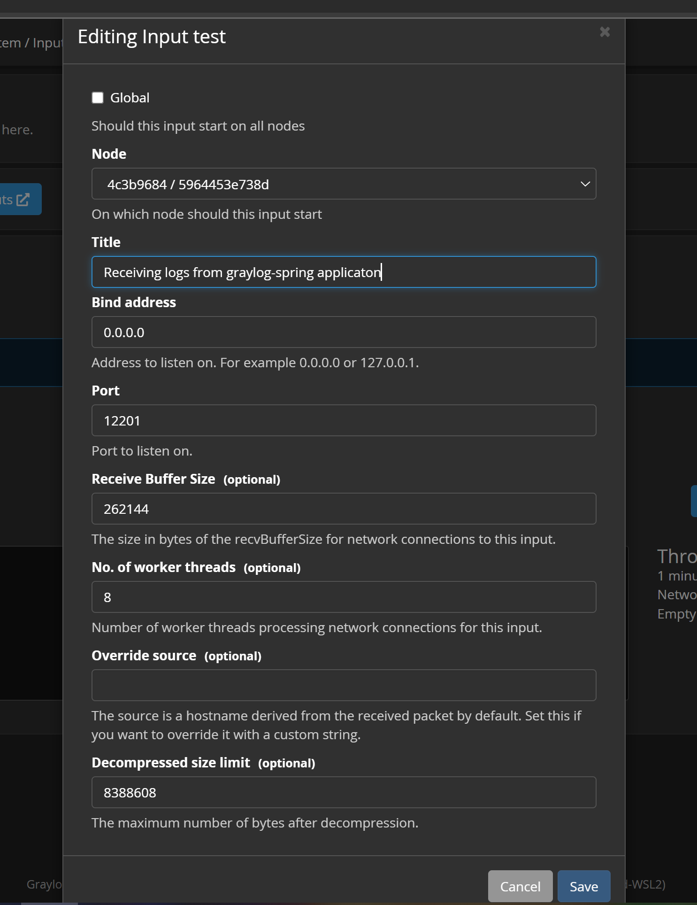
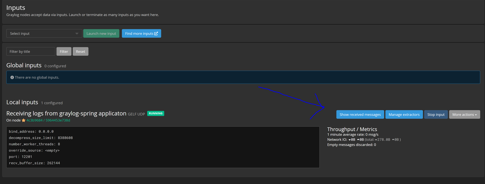
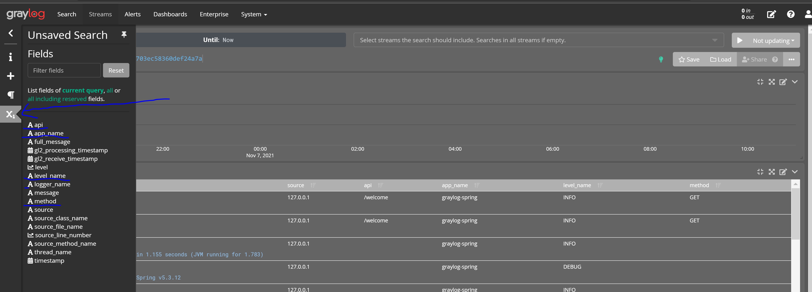
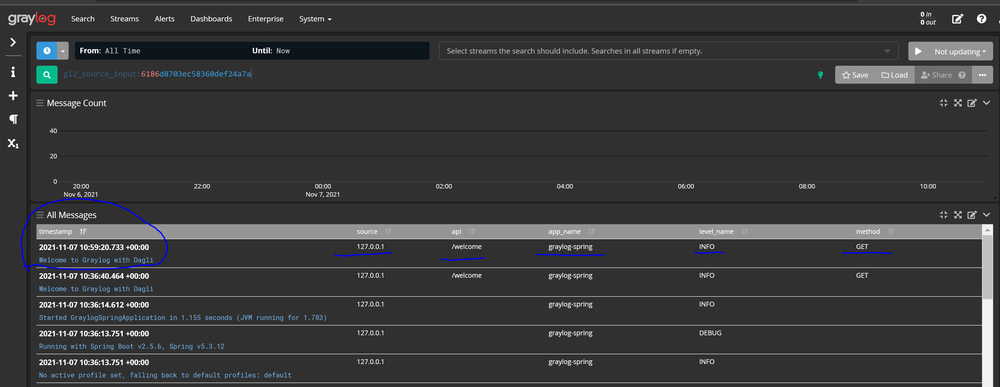

# graylog-spring (free)
Spring boot Centralized Microservices Logging with Graylog.

#Overview
###Centralized Logging
The first and most important rule of microservice logging is those logs should go to a single place.
* [Centralized Logging in Microservices Architecture](https://www.papertrail.com/solution/tips/best-practices-for-centralized-logging-in-microservices-architecture/)
###Graylog (free version)
Graylog is a leading centralized log management solution for capturing, storing, and enabling real-time analysis of terabytes of machine data. Graylog is based on Elasticsearch, MongoDB, and Scala. It has a main server that receives data from its clients which are installed on different servers. It has a web interface that visualizes the data and allows it to work with the logs aggregated by the main server.
* [Graylog](https://www.graylog.org/)

Graylog architecture

More explanation about [Graylog Server](https://www.youtube.com/watch?v=rtfj6W5X0YA&t=1557s)

#Prerequisites
- Java >=11 
- [Slf4j](https://www.baeldung.com/slf4j-with-log4j2-logback)
- [MDC](https://docs.mulesoft.com/mule-runtime/4.4/logging-mdc)
- Docker
- Maven

#Installation
Here is explained locally installation. The same steps can be used for installation on other servers. Just change host and ports.
##How to install Graylog with Docker
1. Clone project
2. Run docker-compose file with command `docker-compose up -d`
3. When import finish, go to http://127.0.0.1:9000 and log in with user admin/admin

##How to send logs to Graylog
In this example will be used Logback-gelf for sending logs to Graylog.  [Logback-gelf](https://github.com/osiegmar/logback-gelf)

1. Add Logback-gelf dependency in pom.xml file
```xml
<dependency>
    <groupId>de.siegmar</groupId>
	  <artifactId>logback-gelf</artifactId>
	  <version>3.0.0</version>
</dependency>
```
2. Create logback-spring.xml file
```xml
<configuration>

  <property name="port" value="12201" />
  <property name="host" value="127.0.0.1" />

  <appender name="STDOUT" class="ch.qos.logback.core.ConsoleAppender">
    <encoder>
      <pattern>%green(%date) %highlight(%-5level) %yellow([%file:%line]) %blue(: %msg%n)</pattern>
      <charset>UTF-8</charset>
    </encoder>
  </appender>

  <appender name="GELF" class="de.siegmar.logbackgelf.GelfUdpAppender">
    <graylogHost>${host}</graylogHost>
    <graylogPort>${port}</graylogPort>
    <maxChunkSize>508</maxChunkSize>
    <useCompression>true</useCompression>
    <encoder class="de.siegmar.logbackgelf.GelfEncoder">
      <originHost>${host}</originHost>
      <includeRawMessage>false</includeRawMessage>
      <includeMarker>true</includeMarker>
      <includeMdcData>true</includeMdcData>
      <includeCallerData>true</includeCallerData>
      <includeRootCauseData>true</includeRootCauseData>
      <includeLevelName>true</includeLevelName>
      <shortPatternLayout class="ch.qos.logback.classic.PatternLayout">
        <pattern>%m%nopex</pattern>
      </shortPatternLayout>
      <fullPatternLayout class="ch.qos.logback.classic.PatternLayout">
        <pattern>%m%n</pattern>
      </fullPatternLayout>
      <staticField>app_name:graylog-spring</staticField>
    </encoder>
  </appender>

  <root level="INFO">
    <appender-ref ref="STDOUT" />
  </root>

  <logger name="com.dagli.graylog" additivity="false">
    <level value="DEBUG"/>
    <appender-ref ref="GELF" />
    <appender-ref ref="STDOUT"/>
  </logger>


</configuration>
```
3. Go to some class (e.g. Controller)
4. Add `@slf4j` annotation to the class
5. Write log `log.info("Welcome to Graylog with Dagli")` [How to write logs with slf4j](https://www.baeldung.com/slf4j-with-log4j2-logback#:~:text=SLF4J%20standardized%20the%20logging%20levels%20which%20are%20different,levels%20used%20are%20ERROR%2C%20WARN%2C%20INFO%2C%20DEBUG%2C%20TRACE.)

## How to configure Web interface
1. Go to Graylog http://127.0.0.1:9000
2. Log in as admin (admin/admin)
3. Go to system -> inputs -> select GELF UDP -> Launch new input

4. Save Input
5. Click on Show received messages

6. Click on fields and add some fields (additional columns: "app_name" we added in logback-spring.xml file, "method" and "api" we added in LogInterceptor.java via MDC)

7. You should be able to see logs along with our additional columns

